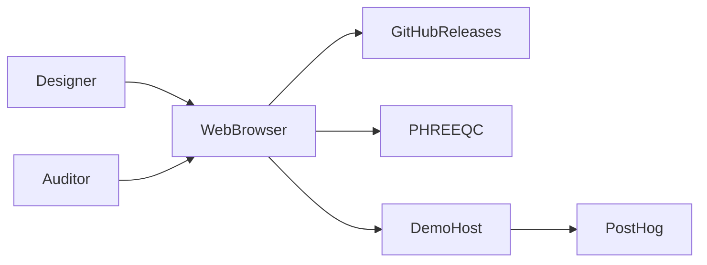

# 3. Context and scope

What Amanzi is in its environment: people, external systems, in and out of scope.

## Content to write

- **In scope:** flowsheet editor, project JSON, solvers, process unit models, reports/design views, static or server-backed calculation.
- **Out of scope:** SCADA, laboratory LIMS, GIS, Excel import, contributor how-to for adding a unit (README / code only).
- External actors: plant designer (human), auditor (human), AI agent (reader of this site).
- External systems: web browser; GitHub Releases (wheels + UI zip); demo host; PostHog (production analytics); PHREEQC/PhreeqPython; optional API Gateway + Lambda.

## Diagrams

C4 context (canonical drawing lives in [c4/context.md](c4/context.md); summary below).

