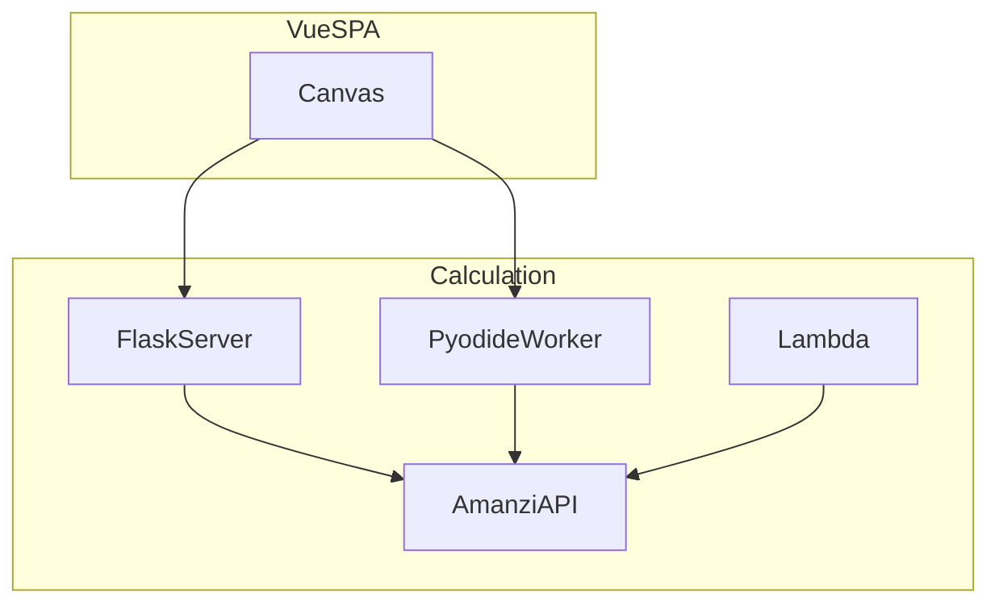

# 5. Building block view

Static decomposition. Level 1 is the system in context; level 2 containers; level 3 named components.

## Content to write

- Level 1: Amanzi as one system (see [C4 context](c4/context.md)).
- Level 2: Vue SPA, calculation backends (Pyodide / Flask / Lambda), data files (JSON, YAML, CSV). See [C4 containers](c4/containers.md).
- Level 3: index of [building blocks](building-blocks/amanzi-api.md) (`bb-*` IDs).
- Mapping table: building-block `id` → repository path (fill when leaving outline).

## Diagrams

Container view (canonical in [c4/containers.md](c4/containers.md)):

