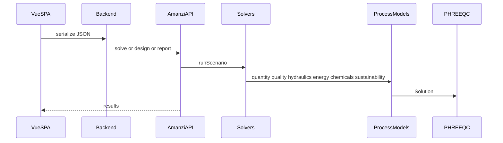

# 6. Runtime view

What happens when a user loads a project and asks for results.

## Content to write

- Bootstrap: load Pyodide wheels **or** connect to Flask/Lambda (`ui/src/main.js`).
- Load: default JSON, `localStorage`, or upload; optional schema migration (`ui/src/lib/projectMigration.js`).
- Validate graph: source + sink, required anchors (`ui/src/stores/scenario.js`).
- Debounced solve vs design vs report (`AmanziAPI.solve` / `design` / `report`).
- Solver chain and recycle iteration on quality (cite `amanzi/components/solvers/`).
- Failure: quality non-convergence; missing key figure; UI generic invalid flag.

## Diagrams

