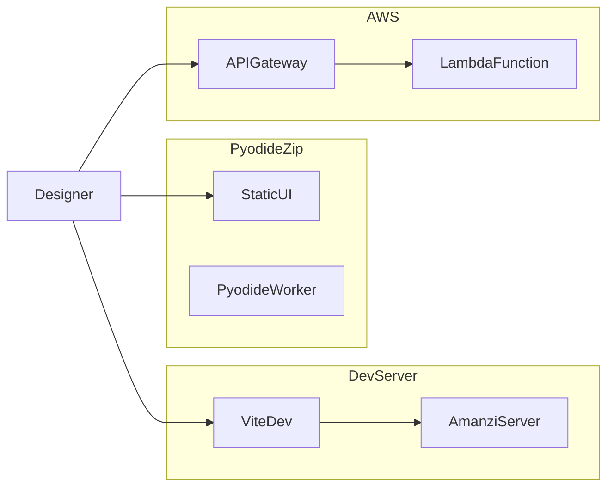

# 7. Deployment view

Where the software runs. Production choice among the three is TBD ([arc42-01](01-introduction-and-goals.md)).

## Content to write

- **Pyodide static zip:** GitHub release; any static file server; wheels in the UI bundle; cite `.github/workflows/deploy-ui.yml`.
- **`amanzi-server`:** Flask on port 7331, serves `ui/dist`, opens browser unless `--no-browser`.
- **AWS Lambda:** Docker image `lambda/Dockerfile`, same `AmanziAPI`.
- CI: user docs and architecture docs zip artifacts; UI deploy workflow.
- TBD: operator of demo host, TLS, RTO/RPO, which backend demo uses.

## Diagrams

