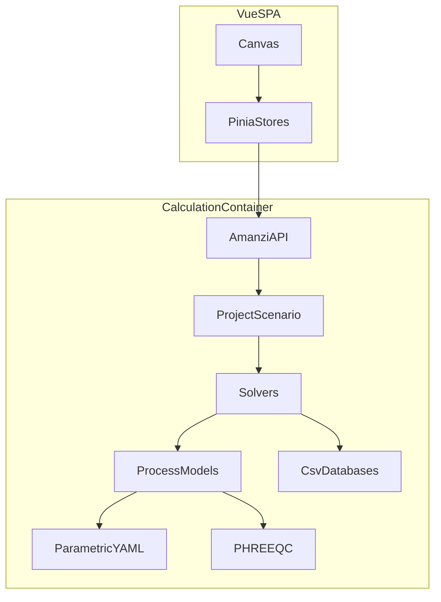

# C4 components

Inside the calculation container and the SPA. Each node maps to a building-block page or a data file.

## Diagram

## Legend

- `Canvas` / `PiniaStores` — `ui/src/components`, `ui/src/stores/`.
- `AmanziAPI` — `amanzi/server/api.py` (`bb-amanzi-api`).
- `ProjectScenario` — `amanzi/core/` (`bb-project-scenario`).
- `Solvers` — `amanzi/components/solvers/` (`bb-solvers`).
- `ProcessModels` — `amanzi/models/` (`bb-process-models`).
- `ParametricYAML` — `amanzi/parametric/` (`bb-parametric-yaml`).
- `PHREEQC` — PhreeqPython `Solution`.
- `CsvDatabases` — `amanzi/database/`, `membranestack/membrane_database.csv`.

## Content to write

- HTTP methods on `AmanziAPI` (`parameters`, `keyfigures`, `solve`, `design`, `report`).
- That the SPA never imports model classes directly.
