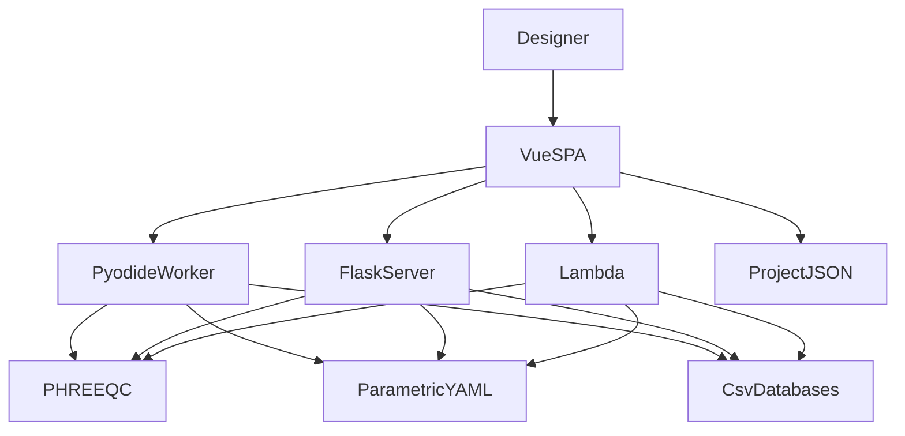

# C4 containers

Runnable / deployable pieces. Only one calculation container is active per session (Pyodide **or** Flask **or** Lambda).

## Diagram

## Legend

- `VueSPA` — `ui/` (Vite, Vue 3, Pinia, Element Plus).
- `PyodideWorker` — `ui/src/backend/python.worker.js`.
- `FlaskServer` — `amanzi/server/app.py` (`amanzi-server`).
- `Lambda` — `lambda/lambda_function.py`.
- `ProjectJSON` — user file / localStorage.
- `ParametricYAML` — `amanzi/parametric/`.
- `CsvDatabases` — key figures, PFAS isotherms, membrane database.

## Content to write

- Protocol on each edge (in-process worker vs HTTP `/api/*`).
- Which container holds PHREEQC in each deployment.
