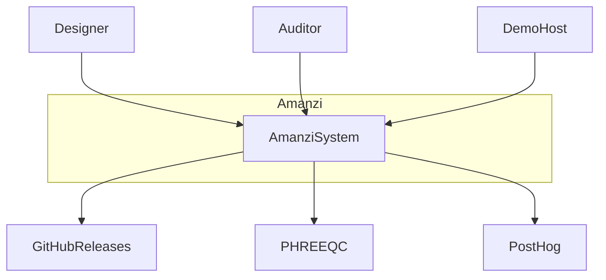

# C4 context

System in its environment. Node IDs are stable for citation.

## Diagram

## Legend

- `Designer` — person drawing scenarios in the GUI.
- `Auditor` — person reading results and this architecture site (not a runtime actor unless they open the app).
- `AmanziSystem` — the product (UI + engine).
- `GitHubReleases` — UI zip and Python wheels.
- `PHREEQC` — chemistry library via PhreeqPython.
- `DemoHost` — TBD operator for `demo.amanzi.app`.
- `PostHog` — production analytics (TBD data classes).

## Content to write

- Trust boundaries (browser vs Vitens host vs AWS).
- What data crosses each edge (project JSON, metrics, no accounts).
