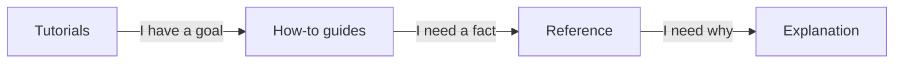

# Amanzi

Amanzi is a design and scenario tool for drinking-water treatment plants. You draw a plant on a canvas, connect water streams, and Amanzi calculates quantity, quality, energy, chemicals, and CO₂ for one or more what-if designs. It is **not** a live plant controller.

Use the [hosted demo](https://demo.amanzi.app) while you learn. You never need to invent a laboratory analysis to start.

## Who this documentation is for

- **New here** (no background in software, process engineering, or water treatment): start with [Tutorials](tutorials/index.md). Use the demo project. When a word looks unfamiliar, open [Explanation](explanation/index.md).
- **Key user** (you already know one of those domains): skip to [How-to guides](how-to/index.md) for a task, [Reference](reference/index.md) for parameters and units, and [Explanation](explanation/index.md) for how the models work and which literature they use.

## The four sections

These are different *kinds* of page, not four difficulty levels.

- **Tutorials** — a guided first experience with the demo plant.
- **How-to guides** — steps for a job you already want to do.
- **Reference** — what a control, stream, unit, or number *is*.
- **Explanation** — what Amanzi is for, what the water numbers mean, and the science behind the models.

## Content to write

- One-paragraph product description in everyday language (canvas, scenarios, five result families).
- Two audience doors with the links above, kept short.
- Honesty box: design/scenario tool, not SCADA, not a substitute for a licensed design.
- Link to the demo and to GitHub releases.
- The four-section map (Mermaid, already drafted).
- Pointer that English is the documentation language; the app itself can be English, Dutch, or German.
